# VBA Challenge

## Overview of Project

### Purpose and Background
The Module 2 solution code uses nested for loops to collect data by first looping through the tickers. For each ticker, loop through the rows. If the row's ticker matches the target ticker, it collects and outputs the information, then repeats the process with the next ticker. With 12 tickers, the dataset is looped 12 times, although it works for a dozen stocks, it might not be efficient to run the code for thousands stocks. The purpose of this project is to refactor the Module 2 solution code to loop through all the data one time in order to collect the same information that I did in the module. Therefore, My goal is to refactor the code to make the VBA script more efficient and run faster. 

## Results

### Original Code
The image below shows the original code:
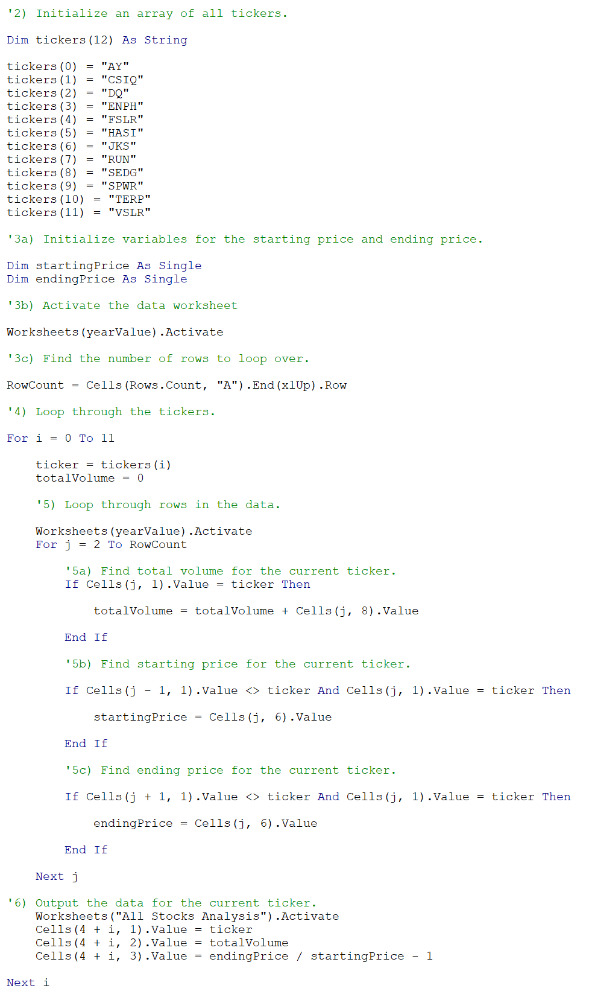

After initializing an array of all the tickers, starting price and ending price were initiated as well. The number of rows are then determined with the code under 3c). The first for loop loops through the tickers one by one. Inside the first for loop, another for loop loops through the rows to find information that matches the current ticker, and outputs the data for the current ticker.

### Refactored Code
Each step of the refactored code are explained with images below
The image below shows the refactored code:
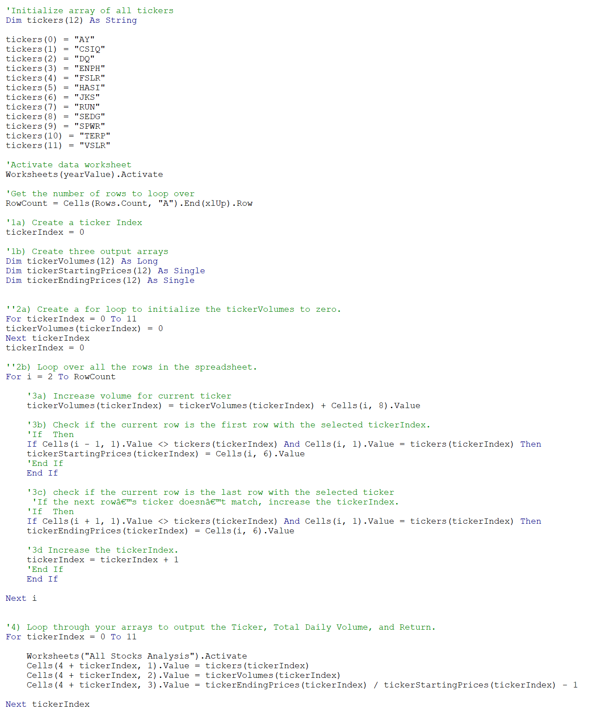

After initializing an array of all the tickers, the number of rows to loop over are determined just as in the original code. A ticker index is then created in 1a) and set as equals to 0 for future use. Three output arrays are created in 1b): tickerVolumes(12), tickerStartingPrices(12), and tickerEndingPrices(12), each with 12 elements (0 to 11) in each with different data types that are suitable.

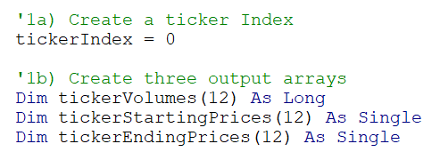

A for loop is then created to initialize the tickerVolumes to 0. After the for loop, the tickerIndex would end up equals to 12, therefore it is then set to 0 again before we start to loop over all the rows in the spreadsheet.
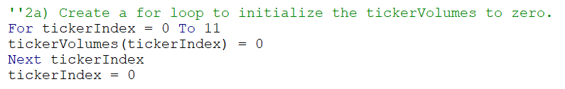

A for loop is then created to loop over the whole dataset, from the second row where the dataset begins to the last row of the dataset. Inside the for loop, since the tickerIndex is equals to 0, the code in 3a) increases the volume for tickerVolumes(0), which adds all the daily volumes that matches with the tickerIndex(0). 

The code in 3b) finds the first row of the current ticker and stores its price as in tickerStartingPrices(0). 

The code in 3c) stores the price of the row as tickerEndingPrices(0) when it reaches the last row of the ticker with tickerIndex = 0. 

After that, in 3d) the tickerIndex is added by 1 so from the next row on, data is stored in tickerVolumes(1), tickerStartingPrices(1), and tickerEndingPrices(1), and the process is repeated until data for tickerIndex = 11 is collected.
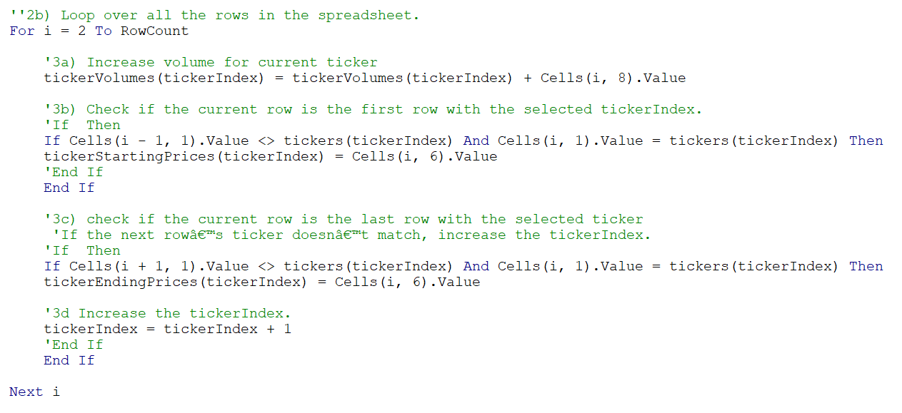

All the data is stored inside three output arrays, and they can be accessed with tickerIndex that matches with the tickers. Therefore, a for loop is created to access the tickers(12) array, the Total Daily Volume from tickerVolumes(12) array, and Return (by dividing tickerEndingPrices(12) by tickerStartingPrices(12), then minus 1) using tickerIndex.
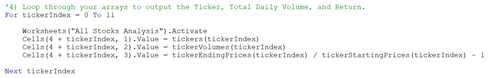

### Stock Performance in 2017 and 2018
Stock performances are determined mainly by its returns, in the analysis, a positive returns are formatted in green background color while a negative returns are formatted in red background color. The total daily volume of the stocks are also collected and displayed.

The image below shows the performance of the stocks in 2017:
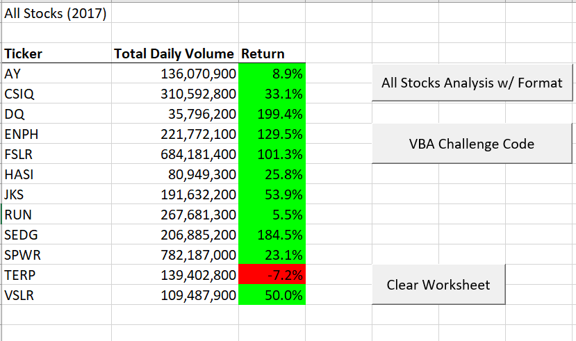

In 2017, 11 of the tickers have a positive return except for TERP, with a -7.2% return.

The image below shows the performance of the stocks in 2017:
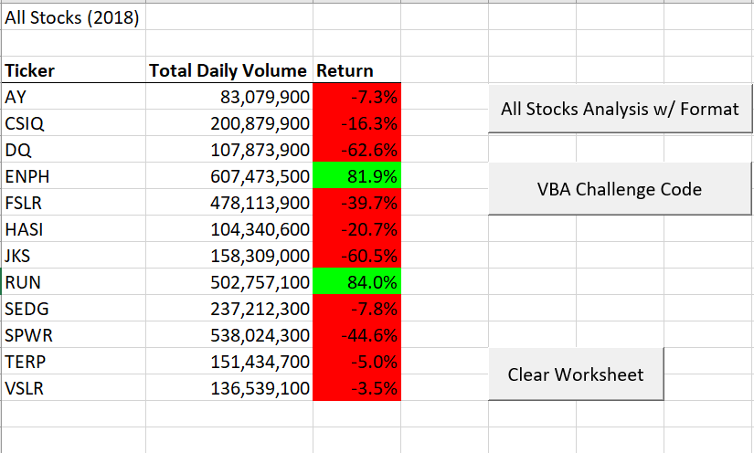

In 2018, only ENPH and RUN have positive returns, while the rest have negative returns.

### Execution times of the original script and the refactored script
For the original script, it took 0.96875 seconds for the year 2017 to execute while it took 0.9375 seconds for the year 2018 to execute.

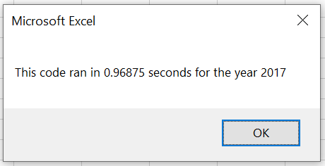
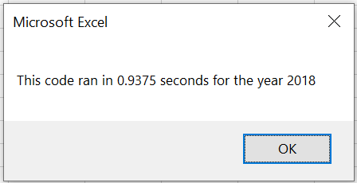

For the refactored script, it took 0.1484375 seconds for both 2017 and 2018 to execute
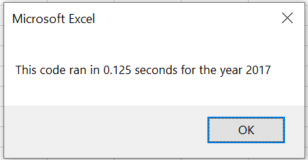

As a result of refactoring the script, the stock analysis now run 6 times faster!

## Summary

### Advantages and Disadvantages of Refactoring Code in General
Refactoring code is an attempt to improve its structure without changing its behaviour. There are some advantages of refactoring code. First of all, it removes redundant code, making it more efficient to run. Second, by structuring codes in blocks, they may be reusable in the future for similar functions. Third, well structured code makes it easier to understand, maintain and make changes to.

However, there are also some disadvantages of refactoring code. First of all, it may require a lot of time and effort to make changes to an "already" functional code. Second, some changes may be too big that it is better to just start from scratch. Third, if the person who attempts tp refactor the code is not the one who wrote it, the code may be too badly written that it is difficult to understand to begin with. 

### Advantages and Disadvantages of Original and Refactored VBA Script
The advantage of the original VBA Script is that it follows a nested for loop that is easy to write and understand. The disadvantage of it is that since it has to loop over the data as many times as the number of tickers, it is only efficient when the number of tickers are small.

On the other hand, the advantage of the refactored VBA Script is that it is a lot more efficient to execute (6 times faster), with the dataset run only once. However, it took a lot more time to build the structure of the code and write it.